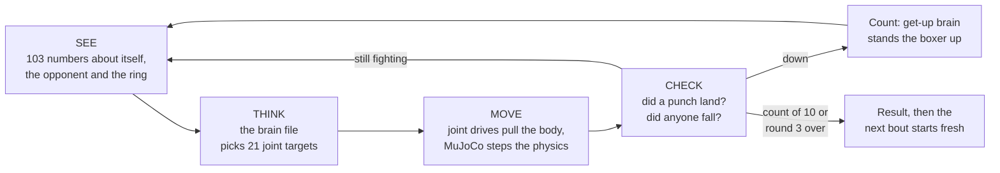
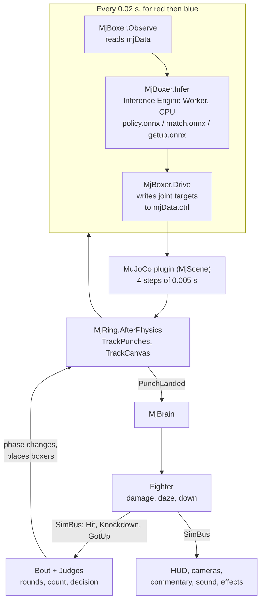
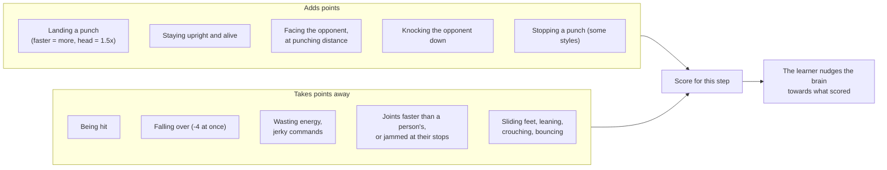

# PoBox: core architecture and game loop

As of 4 October 2026. Unity 6000.6, the official MuJoCo Unity plugin 3.5.0, Unity Inference Engine 2.6.1.
The trainer is Python with MuJoCo Warp, in `training/`. There is no ML-Agents and no PhysX in the fight.

An interactive version with larger diagrams: `architecture_dashboard.html` in this folder.

---

## Tier 1: Quick look

PoBox is a boxing broadcast. Two boxers fight in a ring while the game films it, scores it and
commentates. Nobody animates the boxers. Each one is a physics body with 21 moving joints and a trained
brain that decides, 50 times a second, where every joint should go next.

- **Six boxers** are in the game: Matt, Zombie, Nick, Trump, Grandma, Grandpa.
- **Three brains each**: footwork (stand, walk, turn), get-up, and boxing. The game swaps between them.
- **Same physics in training and in the game.** Both use MuJoCo with the same body file, so a boxer that
  stands in training stands in the game. This is checked by tests for every boxer (18 of 18 pass).
- **A bout** is three rounds of 45 seconds. It ends by knockout (a count of ten) or by three judges.

---

## Tier 2: Core mechanics

### 1. The decision loop

**High-level view**

**Component view (Unity)**

| Step | In plain words | Unity object |
|---|---|---|
| See | The boxer reads its own balance and joints, where the opponent's head, body and gloves are, and where it stands in the ring. There are no cameras or raycasts: the numbers come straight from the physics. | `MjBoxer.Observe` |
| Think | The brain file turns 103 numbers into 21 joint targets and one confidence value. | `MjBoxer.Infer` (Inference Engine, CPU) |
| Move | Each joint has a spring-like drive that pulls towards its target with human strength. MuJoCo then moves the bodies. | `MjBoxer.Drive`, `MjScene` |
| Check | The ring measures every glove against the other boxer's head and body, and watches for falls. | `MjRing`, `Fighter` |
| Reset | In the game a boxer is never reset mid-bout: it goes down, is counted, and gets up by itself. Boxers are placed on their marks at the start of each round. In training an episode ends on a fall or after 12 seconds. | `Bout.Place`, `Fighter.GoDown` |

In training the same loop runs in thousands of rings at once on the GPU (`training/envs/match.py`,
`footwork.py`, `getup.py`), and the "check" step also hands out the score described in section 3.

### 2. Controls and movement map

```mermaid
flowchart LR
  subgraph SENSES["What the boxer senses (103 numbers)"]
    direction TB
    S1["Own motion: speed, spin,<br/>which way is down (9)"]
    S2["Own joints: angle, speed,<br/>last command (63)"]
    S3["Feet on the floor,<br/>hip height (3)"]
    S4["Opponent: head, body,<br/>head speed, gloves, facing (17)"]
    S5["Own gloves (6)"]
    S6["Place in the ring (2)"]
    S7["Walk command: forward,<br/>sideways, turn (3)"]
  end
  subgraph BRAIN["Brain"]
    N["3 layers: 512, 256, 128"]
  end
  subgraph CONTROLS["What the boxer controls (21 joint targets)"]
    direction TB
    C1["Waist: twist, bend, lean (3)"]
    C2["Each arm: shoulder x2, elbow (6)"]
    C3["Each leg: hip x3, knee,<br/>ankle x2 (12)"]
  end
  SENSES --> BRAIN --> CONTROLS
  CONTROLS --> D["Position drives<br/>(MjActuator), torque-limited"] --> B["12 body parts<br/>(MjBody + MjHingeJoint)"]
```

- **Senses.** Positions are measured from the boxer's own hips, facing its own way. It does not sense
  how dazed or tired it is.
- **Controls.** A zero command is the guard pose (gloves by the chin, soft knees). Each command moves a
  joint up to 1.5 radians from the guard, inside the joint's range.
- **No jump trigger, no animation, no root motion.** Walking, punching and getting up all come from the
  same 21 joint targets.
- **Punch names** (jab, cross, hook, uppercut, body) are recognised afterwards from how the glove moved.
  The boxer does not choose them.

### 3. Goals and scoring rules

**In training (what the brain is paid for)**

| Skill | Paid for | Charged for | Episode ends |
|---|---|---|---|
| Stand, walk, turn | upright; moving at the speed asked; facing the stand-in; taking real steps; guard kept up | falling; effort; sliding feet; leaning; fast or jammed joints | on a fall, or after 12 s |
| Get up | hips and head high; standing; back in the guard, still, facing the opponent | effort; sliding feet; fast or jammed joints | after 10 s (a fall does not end it) |
| Boxing | punches landed; knockdowns; upright; facing; right distance; blocks (some styles) | punches taken; falling; effort; sliding feet; leaning; fast or jammed joints | when either falls, or after 12 s |

Each boxer has a **style** that reweights the boxing score: Trump is paid more for hard head shots,
Grandma for counter-punches after a block, Grandpa for his left hand and for keeping his distance, Nick
for many fast punches. Matt and Zombie have no style.

**In the game (what the audience sees)**

| Event | Effect |
|---|---|
| A clean punch | Damage: glove speed (up to 9 m/s) times 2.2 kg, head worth 1.6, arms 0.25 |
| The daze rule | Each punch adds its speed to the daze (body shots 0.3). It drains in about 2.5 s. Above 14 the joints weaken; at 42 the legs go and the boxer is down |
| Knockdown | The referee counts one number every 0.7 s. Ten is a knockout |
| Round | Three judges: POWER (hard punches), VOLUME (clean punches, activity), CRAFT (clean work and blocks). 10-9, a knockdown costs a point |
| Decision | Unanimous, majority or split decision, or a draw. The ladder (Elo, starting at 1000) is updated |

### 4. Tuning settings

| Setting in plain words | Value | Trainer flag (`training/`) | ML-Agents name for the same idea |
|---|---|---|---|
| Learning pace | 0.001 to start, self-adjusting (0.0003 when boxing the others) | `--lr`, `--desired-kl 0.01` | `learning_rate` |
| How far ahead it plans | values rewards about 2 seconds ahead | gamma 0.99 (`ppo.py`) | `gamma` |
| How it smooths credit | 0.95 | lambda (`ppo.py`) | `lambd` |
| Practice gathered per round | 24 steps in 4,096 rings: about 98,000 moments | `--steps 24 --num-envs 4096` | `buffer_size`, `time_horizon` |
| Lesson size | about 24,600 moments, 4 lessons, 5 passes | minibatches, epochs (`ppo.py`) | `batch_size`, `num_epoch` |
| How big a change is allowed | 20% | clip 0.2 (`ppo.py`) | `epsilon` |
| Exploration rate | starts at 0.5 rad of random wobble on each joint, capped at 0.35 when boxing | `--init-std 0.5`, `--max-std` | (PPO action noise) |
| Reward for staying curious | 0.005; none when boxing the others | `--entropy-coef` | `beta` |
| Memory | none: the brain sees only the present moment (its last command is one of its inputs) | (no recurrent layer) | `memory` |
| Brain size | 3 layers of 512, 256 and 128 units | `ppo.py` | `hidden_units`, `num_layers` |
| Practice bout length | 12 s (get-up: 10 s) | `episode_s` | `max_step` |
| Decisions a second | 50 (every 4th physics step of 0.005 s) | `control_decimation 4` | `DecisionRequester` period |
| Body luck | mass, grip, joint strength each vary by 15% per ring | `--randomise 0.15` | environment parameters |
| Shoves and cubes | a shove of 10 to 30 N s about every 3 s; a 1 kg cube about every 3 s | `--shove-max 30`, cube pool | (custom) |
| Starting distance when boxing | 0.85 to 3.5 m apart | `--sep-max 3.5` | (custom) |
| Human rules | joint torque fades to nothing at the joint's speed limit; drives tire with energy spent | `--speed-limit --fatigue-j 30000` | (custom) |

---

## Tier 3: Setup guide

### Run the game

1. Open `Assets/Scenes/Menu.unity` and press Play. Pick a boxer for each corner, then FIGHT.
2. Or open `Assets/Scenes/Arena.unity` and press Play for the default pair (Matt v Zombie).
3. To check one boxer alone, open `Assets/Scenes/Testbed.unity`: reset, shove, throw a cube, and switch
   between stand, walk and turn.

### Objects to know in the Arena scene

| Object | Component | Settings that matter |
|---|---|---|
| `Bout` | `Bout`, `LeagueTable`, `MatchSetup` | `rounds` 3, `roundSeconds` 45, `countInterval` 0.7, `physicsStep` 0.005, `defaultRed` matt, `defaultBlue` zombie |
| `Mj Ring` | `MjRing` | `physicsStep` 0.005, `ringHalf` 3.05. Do not change the step: the brains were trained at it |
| `Mj World` | MuJoCo plugin (`MjScene`, floor, four rope walls, cube pool) | built from `training/models/v2/matt_spar.xml` |
| `Fighters/NAME Red`, `NAME Blue` | `Fighter`, `MjBrain`, `MjBoxer`, `MjBody` tree | switched off; `MatchSetup` switches on the picked pair |
| `Broadcast` | `BroadcastDirector` | eleven Cinemachine shots; `bigHit` 13 N s cuts to the impact camera |
| `Diagnostics` | `PerfTelemetry` | `targetFps` 60 |

### A boxer's files (`Assets/Boxers/NAME/`)

| File | What it is |
|---|---|
| `NAME.prefab`, `NAME Red.prefab`, `NAME Blue.prefab` | the body and mesh; the corner versions carry the game components |
| `config.json` | joint order, ranges, torque and speed limits, strength, the human rules |
| `policy.onnx`, `getup.onnx`, `match.onnx` | footwork, get-up and boxing brains (1.7 MB each) |
| `fingerprint.json` | what the trainer's model compiles to; Unity's must match it |
| `reference_trajectory.json`, `falls.json` | recordings from plain MuJoCo for the gate tests |

### Joint limits (same ranges for all six; strength and speed scale per boxer)

| Joint | Range (degrees) | Max torque, Matt (N m) | Max speed (rad/s) |
|---|---|---|---|
| Waist twist, bend, lean | -45 to 45, -60 to 30, -35 to 35 | 179 | 8 |
| Shoulder raise, swing | 200 total, 220 total | 105 | 20 |
| Elbow | 0 to 150 | 74 | 25 |
| Hip sideways, twist, forward | -40 to 40, -35 to 35, -120 to 30 | 253 | 15 |
| Knee | 0 to 150 | 274 | 20 |
| Ankle up and down, roll | -20 to 50, -25 to 25 | 232, 63 | 14 |

Grandma and Grandpa have about half the torque (strength 0.53 and 0.48) and three quarters of the speed.

### Train a boxer and put it in the game

1. Train: `training/train_box.py --stage footwork` (stand, walk, turn), `training/train_getup.py`
   (get-up), `training/train_gauntlet.py --stage match` (boxing against the frozen others). Start
   TensorBoard on `training/logs/tb`.
2. Examine: `training/tools/footwork_c.py --exam` and `training/tools/exam_v2.py`. A run that makes any
   line worse gets a `REJECTED.txt` and is skipped from then on.
3. Promote, in the Unity editor: `MjRetrofit.Promote(name, run)` for footwork and
   `MjRetrofit.PromoteBoxing` for boxing and get-up.
4. Gate: run the play-mode tests `MjGateTests` and `MjParityTests` (assembly filter `PoBox.Tests`).
5. Log what was run and decided in `rl_optimization_log.md`.

### Rules that keep it working

- Fixed timestep 0.005 s; decisions every 4th step. Speed-up changes `Time.timeScale` only.
- No Unity physics: the scenes hold no Collider, Rigidbody or Joint, and a test fails if one appears.
- The plugin overwrites joint targets after every step, so `MjRing` writes them again before each one.
- One GPU job at a time; close the Unity editor for long training runs.
